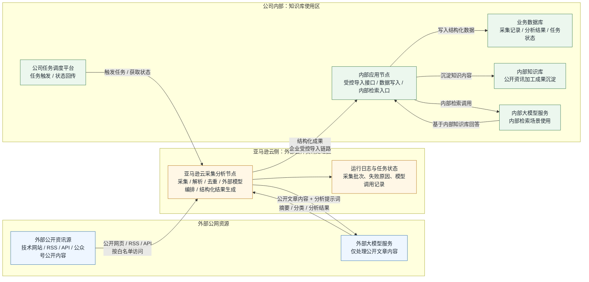
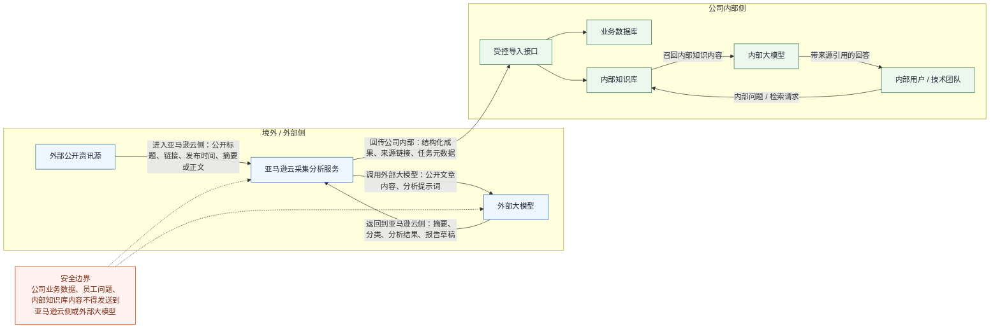
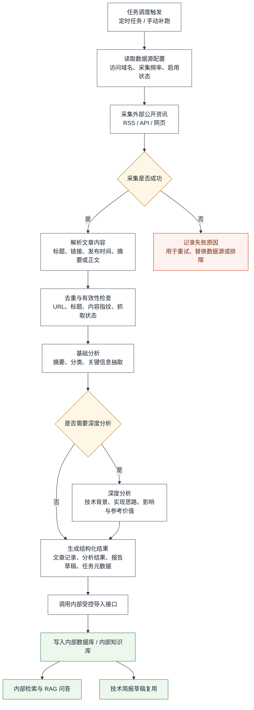

# 资源提供方事项说明配图（Mermaid）

## 1. 总体架构图

```mermaid
flowchart LR
    subgraph EXT["外部公网资源"]
        SITES["外部公开资讯源<br/>技术网站 / RSS / API / 公众号公开内容"]
        ELLM["外部大模型服务<br/>仅处理公开文章内容"]
    end

    subgraph AWS["亚马逊云侧：外部公开资讯处理区"]
        direction TB
        AWSNODE["亚马逊云采集分析节点<br/>采集 / 解析 / 去重 / 外部模型编排 / 结构化结果生成"]
        AWSLOG["运行日志与任务状态<br/>采集批次、失败原因、模型调用记录"]
        AWSNODE --> AWSLOG
    end

    subgraph IN["公司内部：知识库使用区"]
        direction TB
        SCH["公司任务调度平台<br/>任务触发 / 状态回传"]
        INNODE["内部应用节点<br/>受控导入接口 / 数据写入 / 内部检索入口"]
        DB["业务数据库<br/>采集记录 / 分析结果 / 任务状态"]
        KB["内部知识库<br/>公开资讯加工成果沉淀"]
        ILLM["内部大模型服务<br/>内部检索场景使用"]

        SCH -->|"触发任务 / 获取状态"| AWSNODE
        INNODE -->|"写入结构化数据"| DB
        INNODE -->|"沉淀知识内容"| KB
        INNODE -->|"内部检索调用"| ILLM
        ILLM -->|"基于内部知识库回答"| INNODE
    end

    SITES -->|"公开网页 / RSS / API<br/>按白名单访问"| AWSNODE
    AWSNODE -->|"公开文章内容 + 分析提示词"| ELLM
    ELLM -->|"摘要 / 分类 / 分析结果"| AWSNODE
    AWSNODE -->|"结构化成果<br/>企业受控导入链路"| INNODE

    classDef external fill:#EEF6FF,stroke:#2F6FAB,color:#1F2933;
    classDef aws fill:#FFF7E6,stroke:#B7791F,color:#1F2933;
    classDef internal fill:#ECF7EE,stroke:#3A7C4F,color:#1F2933;
    class SITES,ELLM external;
    class AWSNODE,AWSLOG aws;
    class SCH,INNODE,DB,KB,ILLM internal;
```

## 2. 数据流图

```mermaid
flowchart LR
    subgraph OUT["境外 / 外部侧"]
        SRC["外部公开资讯源"]
        AWS["亚马逊云采集分析服务"]
        ELLM["外部大模型"]
    end

    subgraph IN["公司内部侧"]
        IMPORT["受控导入接口"]
        DB["业务数据库"]
        KB["内部知识库"]
        ILLM["内部大模型"]
        USER["内部用户 / 技术团队"]
    end

    SRC -->|"进入亚马逊云侧：公开标题、链接、发布时间、摘要或正文"| AWS
    AWS -->|"调用外部大模型：公开文章内容、分析提示词"| ELLM
    ELLM -->|"返回到亚马逊云侧：摘要、分类、分析结果、报告草稿"| AWS
    AWS -->|"回传公司内部：结构化成果、来源链接、任务元数据"| IMPORT
    IMPORT --> DB
    IMPORT --> KB
    USER -->|"内部问题 / 检索请求"| KB
    KB -->|"召回内部知识内容"| ILLM
    ILLM -->|"带来源引用的回答"| USER

    BLOCK["安全边界<br/>公司业务数据、员工问题、内部知识库内容不得发送到亚马逊云侧或外部大模型"]
    BLOCK -.-> AWS
    BLOCK -.-> ELLM

    classDef external fill:#EEF6FF,stroke:#2F6FAB,color:#1F2933;
    classDef internal fill:#ECF7EE,stroke:#3A7C4F,color:#1F2933;
    classDef warn fill:#FFF1F0,stroke:#C2410C,color:#7C2D12;
    class SRC,AWS,ELLM external;
    class IMPORT,DB,KB,ILLM,USER internal;
    class BLOCK warn;
```

## 3. 处理逻辑图

```mermaid
flowchart TB
    START["任务调度触发<br/>定时任务 / 手动补跑"] --> LOAD["读取数据源配置<br/>访问域名、采集频率、启用状态"]
    LOAD --> FETCH["采集外部公开资讯<br/>RSS / API / 网页"]
    FETCH --> FAIL{"采集是否成功"}
    FAIL -->|"是"| PARSE["解析文章内容<br/>标题、链接、发布时间、摘要或正文"]
    PARSE --> DEDUP["去重与有效性检查<br/>URL、标题、内容指纹、抓取状态"]
    DEDUP --> BASIC["基础分析<br/>摘要、分类、关键信息抽取"]
    BASIC --> DEEP_CHECK{"是否需要深度分析"}
    DEEP_CHECK -->|"是"| DEEP["深度分析<br/>技术背景、实现思路、影响与参考价值"]
    DEEP_CHECK -->|"否"| STRUCT
    DEEP --> STRUCT["生成结构化结果<br/>文章记录、分析结果、报告草稿、任务元数据"]
    STRUCT --> IMPORT["调用内部受控导入接口"]
    IMPORT --> STORE["写入内部数据库 / 内部知识库"]
    STORE --> RAG["内部检索与 RAG 问答"]
    STORE --> REPORT["技术简报草稿复用"]
    FAIL -->|"否"| LOG["记录失败原因<br/>用于重试、替换数据源或排障"]

    classDef step fill:#FFFFFF,stroke:#4B5563,color:#1F2933;
    classDef decision fill:#FFF7E6,stroke:#B7791F,color:#1F2933;
    classDef output fill:#ECF7EE,stroke:#3A7C4F,color:#1F2933;
    classDef warn fill:#FFF1F0,stroke:#C2410C,color:#7C2D12;
    class START,LOAD,FETCH,PARSE,DEDUP,BASIC,DEEP,STRUCT,IMPORT step;
    class DEEP_CHECK,FAIL decision;
    class STORE,RAG,REPORT output;
    class LOG warn;
```
