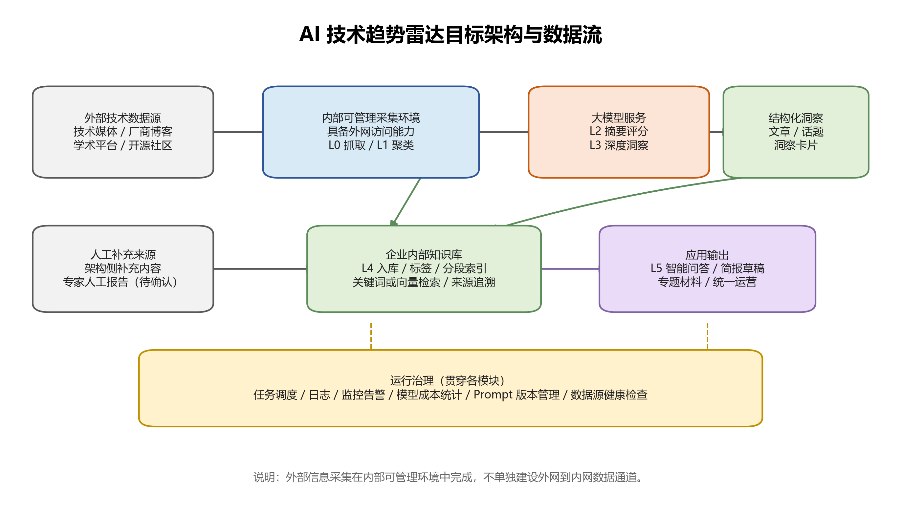
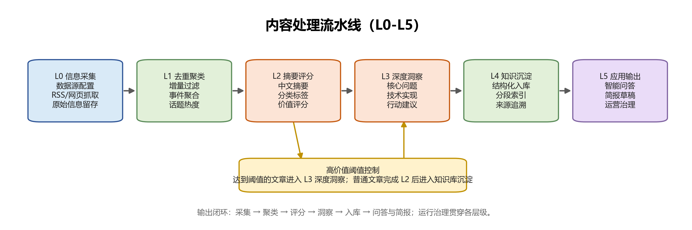

# 一、背景与目标
AI 技术持续影响软件研发、平台建设和业务创新，技术团队需要稳定跟踪外部技术动态，并将分散在技术媒体、厂商博客、学术平台、开源社区和人工报告中的信息转化为内部可检索、可复用的技术知识。当前相关信息主要依赖人工收集、筛选和整理，难以稳定形成统一的技术洞察机制。

本项目建设 AI 技术趋势雷达，目标是形成“信息采集、自动分析、知识入库、智能检索、简报输出、人工复核”的闭环能力，解决技术趋势内容“没人持续写”和“看完难以复用”的问题。系统不只输出文章或报告，更应沉淀为技术团队在方案调研、技术选型和创新验证时可查询、可引用的知识资产。

前期已基于公司外网络环境搭建可运行的外部版本，能够完成资讯抓取、聚类去重、价值评分、摘要生成和深度洞察等流程。内部版本应复用其已验证能力，并在企业受控采集环境、内部知识库、人工复核和运营评价方面补齐正式使用要求。

# 二、典型使用场景
1. 技术趋势跟踪。持续跟踪 AI 领域重点技术动态，覆盖大模型基础技术、Agent、多模态、AI 基础设施、生成式 AI 应用和开源生态等方向，帮助技术团队了解外部技术演进。
2. 技术选型与方案参考。在架构规划、技术选型、方案设计或创新验证过程中，技术团队可查询系统沉淀的文章摘要、技术事件和深度洞察，快速找到可参考的外部实践。
3. 内部知识复用。外部资讯经过采集、聚类、评分、摘要和洞察生成后，沉淀到内部知识库，支持后续检索、问答和专题复盘。
4. 周期性技术简报。系统生成周报、月报或专题报告草稿，经人工复核后用于技术团队同步、技术社区运营或管理汇报。
5. 运营效果评估。通过阅读量、点击量、问答使用量、知识库命中情况、技术采纳案例等指标，评估技术雷达是否真正被使用，而不是仅形成一次性材料。

# 三、产品范围
#### 1. 范围内
1）外部 AI 技术资讯采集。系统通过企业受控采集环境完成信息采集，支持技术媒体、厂商博客、学术平台、开源社区、行业研究机构等来源，并保留标题、链接、发布时间、来源、摘要或正文等基础信息。
2）内容去重、聚类和热度识别。系统对采集内容进行去重，并按技术事件、产品发布或主题方向聚合为话题，形成可用于趋势判断的事件视图。
3）文章摘要、分类和价值评分。系统生成中文摘要，按照 AI 技术分类体系归类，并对文章技术价值进行评分，用于筛选高价值内容。
4）深度洞察生成。系统对达到阈值的高价值文章提取技术背景、核心问题、技术实现、效果指标、应用场景和可借鉴点，形成结构化洞察卡片。
5）沉淀到内部知识库。系统将文章摘要、技术事件、深度洞察卡片等结构化结果沉淀到内部知识库，支持检索、问答、来源追溯和后续复用。
6）智能检索与问答。系统基于已入库内容支撑自然语言查询，返回相关摘要、洞察和来源依据，服务趋势查询、方案调研和知识复用。
7）简报草稿生成。系统支持生成周报、月报或专题报告草稿，供人工复核、编辑和发布。
8）人工复核与运营。系统应支持人工复核、内容修正、简报确认和运营指标统计，避免全自动发布带来的内容质量和安全风险。

#### 2. 暂不纳入或不作为首要目标
1）暂不建设复杂前端门户，优先完成采集、分析、入库、问答和简报草稿能力。
2）暂不展开复杂权限体系，优先复用内部知识库既有权限能力。
3）暂不实现多渠道自动发布，正式发布前必须经过人工确认。
4）暂不扩展为全技术领域雷达，首期聚焦 AI 技术趋势。

#### 3. 首期 MVP 范围
| 范围类型 | 内容 |
| --- | --- |
| 必做 | 1）接入首批不少于 8 个数据源，覆盖技术媒体、厂商博客、学术平台和开源社区。 2）完成 L0-L4 闭环，包括采集、去重聚类、摘要评分、深度洞察和内部知识库入库。 3）支持每日定时抓取和手动补跑。 4）对达到 L3 触发阈值的文章生成深度洞察卡片。 5）基于知识库完成典型问题问答验证，回答必须包含来源依据。 6）生成一份 AI 技术趋势周报草稿，并支持人工复核。 |
| 选做 | 1）接入架构侧补充内容或专家人工报告样例。 2）生成专题报告草稿。 3）建立初版数据源质量评分、阅读量统计和模型调用成本统计。 |
| 暂缓 | 1）复杂前端门户。 2）全自动多渠道发布。 3）全员权限矩阵。 4）覆盖 AI 以外的其他技术领域。 |

# 四、功能范围与分层能力
现有外部版本已验证 L0-L3 的核心处理链路。内部版本应在此基础上补齐受控运行、内部知识库适配、人工复核和运营评价能力。

【图1：AI 技术趋势雷达目标架构与数据流，见 assets/figure1_architecture.png】

| 层级 | 功能模块 | 外部版本功能基础 | 内部版本要求 | 差距与后续任务 | 主要产出 |
| --- | --- | --- | --- | --- | --- |
| L0 | 信息采集与数据源管理 | 1）已支持 RSS/网页源抓取。 2）已接入约 12 个外部数据源。 3）已具备文章 ID 去重和并发抓取能力。 | 1）部署在企业受控采集环境中。 2）支持数据源配置、启停、抓取频率配置。 3）记录抓取结果和基础异常信息。 | 1）运行环境需由个人外网环境迁移至企业受控采集环境。 2）数据源需形成正式清单、质量评估和失效处理机制。 3）抓取任务需纳入统一调度和日志管理。 | 原始文章池、数据源清单、抓取日志 |
| L1 | 去重聚类与话题热度 | 1）已沉淀 L1 动态话题表。 2）已维护话题热度、包含文章数、首次涌现时间和最近活跃时间。 | 1）按 URL、标题、发布时间、语义相似度等维度去重。 2）将同一事件、产品发布或技术主题聚合为话题。 | 1）需明确聚类阈值、热度计算口径和重复内容处理规则。 2）需降低低质量重复报道对话题热度的影响。 | 动态话题、热度信息、关联文章 |
| L2 | 摘要分类与价值评分 | 1）已生成中文标题、AI 分类、AI 打分、摘要、技术标签和涉及厂商。 2）已用评分区分“晋级 L3”和“止步快讯”。 | 1）形成稳定评分口径和分类体系。 2）识别具备工程实践价值、架构参考价值或趋势价值的内容。 | 1）需固化评分标准，避免模型评分漂移。 2）需将字段命名、分类和标签调整为内部知识库友好格式。 | 文章分析结果、分类标签、高价值文章候选 |
| L3 | 深度洞察 | 1）已对高分文章生成 L3 深度洞察卡片。 2）已包含核心痛点、技术实现、量化指标、行动建议等字段。 | 1）对高价值文章提取技术背景、核心问题、实现方案、效果指标、应用场景和内部参考价值。 2）形成可入库、可检索、可进入简报的洞察卡片。 | 1）需明确 L3 触发阈值和字段标准。 2）需优化事实性、可读性和来源可追溯性。 | 深度洞察卡片、技术参考建议 |
| L4 | 知识库与问答 | 1）已支持同步至火山知识库。 2）已形成可用于知识检索的摘要和洞察内容。 | 1）适配内部知识库。 2）支持文档入库、标签、分段索引、关键词或向量检索、来源追溯。 3）支撑趋势查询和方案参考问答。 | 1）需对接内部知识库 API、分段、标签、向量检索和权限能力。 2）需验证典型问题的问答效果。 | 知识库文档、索引数据、问答结果 |
| L5 | 简报与运营 | 1）外部版本已具备支撑简报的摘要、话题和洞察基础。 2）已具备基础重试、模型 fallback 和运行统计。 | 1）支持周报、月报或专题报告草稿生成。 2）支持人工复核、运营数据统计和反馈闭环。 3）预留人工内容接入能力。 | 1）需设计简报模板、复核流程和发布节奏。 2）需补齐阅读量、点击量、问答使用量、采纳案例等效果指标。 | 简报草稿、专题材料、运营指标 |

【图2：内容处理流水线，见 assets/figure2_pipeline.png】

核心处理流程为：L0 信息采集 → L1 去重聚类 → L2 摘要评分 → L3 深度洞察 → L4 知识入库与问答 → L5 简报输出与运营评价。

# 五、数据与知识库要求
#### 1. 核心内容对象
需求阶段仅定义核心内容对象和关键字段，详细表结构由概要设计阶段确定。

| 数据对象 | 说明 | 关键字段 |
| --- | --- | --- |
| 数据源 Source | 记录外部信息来源及采集配置 | source_id、source_name、source_type、url、抓取频率、启用状态、健康状态 |
| 原始文章 Article | 记录抓取到的原始文章信息 | article_id、title、url、source_name、publish_time、crawl_time、raw_summary、content_hash |
| 技术话题 Topic | 记录聚类后的技术事件或趋势主题 | topic_id、topic_name、topic_summary、category、heat_score、article_count、related_articles |
| 文章分析 ArticleInsight | 记录文章级摘要、分类、评分和标签 | article_id、summary_cn、category、value_score、tech_tags、companies、process_status |
| 深度洞察 DeepInsight | 记录高价值文章的深度分析结果 | insight_id、article_id、core_problem、technical_solution、metrics、action_suggestions、internal_reference |
| 简报 Briefing | 记录周期性输出内容 | briefing_id、briefing_type、time_range、hot_topics、key_insights、generated_content、review_status |

#### 2. 评分与晋级规则
系统采用 `value_score` 表示文章技术价值，评分范围为 1-10 分。评分维度包括技术深度、工程参考价值、趋势重要性、来源可信度和时效性。首期各评分维度可按等权处理，后续根据人工评测结果、简报采用情况和问答反馈调整权重。

L3 深度洞察默认触发阈值为 `value_score >= 8`。7 分内容可进入简报候选或人工复核队列；6 分及以下内容默认仅保留摘要和基础标签，不触发深度洞察。阈值应配置化管理。

#### 3. 知识库要求
内部知识库是技术雷达的核心沉淀位置，应满足以下要求：
1）支持文章摘要、技术话题、深度洞察卡片、简报等内容分层入库。
2）支持分类、标签、来源、发布时间、评分、关联话题等字段检索。
3）支持关键词检索、标签筛选、向量召回和来源引用。
4）所有入库内容应保留原文链接、来源名称、发布时间、生成时间和模型信息。
5）自动采集内容入库时应标记 `content_source=auto_generated`、`review_status=review_pending`；用于管理汇报、正式发布或专家报告归档前必须人工复核。

# 六、选型思路
本项目在需求阶段不确定最终技术选型，但需明确哪些环节需要选型，以及选型时应关注的原则。

| 选型项 | 选型关注点 | 外部参考或建议 |
| --- | --- | --- |
| 采集运行环境 | 是否可访问目标外部站点；是否企业可管理；是否满足安全审计要求；是否支持定时任务和日志留存。 | 优先评估企业境外云主机、DMZ 主机或经审批的代理访问主机。 |
| 数据源 | 来源质量、更新频率、访问稳定性、技术深度、重复度和覆盖方向。 | 首期复用外部版本已接入数据源，并补充厂商官方博客、开源社区、学术平台等高质量来源。 |
| 大模型服务 | 英文技术内容理解、中文摘要质量、评分稳定性、深度洞察质量、成本、企业可用性和合规要求。 | 可参考外部版本的“轻量模型处理摘要评分、强模型处理深度洞察”分层思路；候选模型可比较豆包、通义千问、DeepSeek、Kimi、Gemini 等。 |
| 知识库平台 | 入库 API、标签字段、分段索引、向量检索、权限继承、来源引用和智能体集成能力。 | 可参考火山引擎知识库等通用知识库能力，但最终应以内部知识库平台能力为准。 |
| 任务调度 | 定时运行、失败重试、手动补跑、日志记录、告警能力和运维接入成本。 | 可复用企业现有调度平台；若无统一平台，可先采用轻量定时任务方案。 |
| 简报生成与发布渠道 | 是否支持草稿生成、人工编辑、来源引用、格式调整、阅读数据统计和人工确认发布。 | 首期优先生成 Word/Markdown 草稿；发布渠道可优先考虑零氪公众号、技术社区或信息技术部群内人工发布。 |

# 七、产品呈现形式与运营流程
#### 1. 产品呈现形式
1）知识库与问答入口。沉淀后的文章摘要、技术话题和深度洞察进入内部知识库，供技术人员通过检索或智能体问答使用。这是解决“没人看”问题的核心方式，即让内容在实际方案调研和技术选型场景中被重新召回。
2）技术简报草稿。系统按周或专题生成简报草稿，包含本期热点、重点洞察、推荐阅读和来源链接。首期建议以周报为主，频率不宜过高，避免形成运营负担。
3）人工复核稿。系统输出内容应先进入人工复核环节，可先形成 Word 或 Markdown 草稿，由架构侧、运营人员或专家进行编辑确认。
4）发布材料。经复核后的内容可人工发布至零氪公众号、技术社区或信息技术部相关群组。系统不要求首期实现全自动发布。
5）引用外链。简报和问答结果应保留原文链接或内部知识库引用，便于读者继续阅读和复核。

#### 2. 人工审核与发布流程
1）系统自动生成文章摘要、深度洞察和简报草稿。
2）运营人员或架构师进行初审，修正标题、摘要、标签、评分和简报结构。
3）涉及管理汇报、重点专题或专家报告归档的内容，由专家审核人或相关负责人复核。
4）复核通过后，由人工发布或人工确认后发布，不做无审核的全量自动推送。
5）发布后记录阅读量、点击量、问答使用量、反馈意见和可能的技术采纳案例。

#### 3. 运营评价指标
为避免技术雷达成为“只产出没人看”的材料，应建立运营评价指标：
1）内容产出指标：抓取文章数、有效文章数、高价值文章数、深度洞察数、简报草稿数。
2）内容质量指标：人工复核通过率、标签修正率、摘要修正率、简报可用率。
3）阅读触达指标：简报阅读量、链接点击量、发布渠道覆盖人数。
4）知识复用指标：知识库检索次数、智能问答次数、回答来源命中率。
5）技术采纳指标：被架构规划、技术选型、方案设计或创新验证引用的案例数。

# 八、运行与非功能要求
1. 部署边界。系统应部署在企业受控采集环境中，不长期依赖个人外网环境。采集结果通过内部知识库 API、受控导入服务或同等内部接口进入内部知识库。
2. 人工审核。自动采集内容可用于内部检索和问答；用于管理汇报、正式发布、专家报告归档或多渠道推送前必须经过人工复核，并将 `review_status` 更新为 `reviewed`。
3. 可维护性。数据源、评分阈值、分类体系、模型配置、Prompt 模板和简报模板应支持配置化维护。
4. 可观测性。系统应记录任务状态、处理数量、失败原因、模型调用次数、入库结果和数据源健康状态。
5. 成本控制。系统应区分轻量分析和深度分析任务，控制高成本模型调用触发条件，并统计模型调用量。
6. 可追溯性。所有入库内容应保留原文来源、生成时间、模型名称和 Prompt 版本。

# 九、验收标准
验收以首期 MVP 闭环为准，重点验证 L0-L4 是否稳定运行，并验证 L5 简报和问答是否具备可用基础。以下指标作为首期评审口径；如需调整，应经评审确认。

| 验收项 | 量化验收标准 |
| --- | --- |
| 数据源接入 | 首批启用数据源不少于 8 个，覆盖技术媒体、厂商博客、学术平台、开源社区中至少 3 类来源。 |
| 定时采集 | 支持每日定时抓取不少于 1 次，并支持手动补跑；连续 7 日运行期间，启用数据源抓取成功率不低于 80%。 |
| 元数据完整性 | 入库文章中标题、来源、原文链接、发布时间或抓取时间字段完整率不低于 95%。 |
| 增量与去重 | 重复入库率不高于 5%；同一 URL 或同一内容哈希不得重复入库。 |
| 文章分析 | 对成功抓取的新文章，摘要、分类、标签、评分字段生成成功率不低于 90%。 |
| 深度洞察 | 在正文可获取且模型调用可用的情况下，`value_score >= 8` 的文章应触发深度洞察生成；抽检不少于 20 条洞察卡片，核心问题、技术实现、行动建议三类字段完整率不低于 90%。 |
| 知识库入库 | 文章分析结果和深度洞察入库成功率不低于 95%，且每条内容可追溯原文来源。 |
| 智能问答 | 以不少于 10 个典型问题进行验证，人工评审认为回答相关且来源支撑充分的比例不低于 80%，所有回答必须返回来源引用。 |
| 简报生成 | 至少生成 1 份 AI 技术趋势周报草稿；经人工复核后，主要栏目完整，内容可作为内部同步材料继续编辑使用。 |
| 运营评价 | 能够记录简报阅读量、链接点击量、问答使用量或人工反馈中的至少 2 类指标。 |
| 配置维护 | 数据源、分类体系、评分阈值、模型配置和 Prompt 模板应支持配置化维护。 |

# 十、风险与待确认事项
#### 1. 主要风险
| 风险 | 影响 | 应对要求 |
| --- | --- | --- |
| 受控采集环境审批或网络访问不满足要求 | 目标数据源无法稳定访问，影响首期闭环 | 在概要设计阶段优先完成采集环境选型、网络连通性验证和数据源访问测试。 |
| 内容没人看或难以复用 | 技术雷达变成单向材料输出 | 将内容沉淀到知识库和问答入口，并统计阅读、点击、问答和采纳情况。 |
| 数据源质量参差不齐 | 低价值内容过多，影响简报质量 | 建立来源权重、评分阈值和数据源淘汰机制。 |
| 内部知识库接口能力不足 | 入库、检索或问答引用效果不达预期 | 提前验证 API、标签、分段、向量检索、权限继承和引用展示能力。 |
| 模型生成结果不稳定 | 摘要、评分或洞察质量波动 | 建立 Prompt 版本管理、样例评测和人工抽检机制。 |
| 简报发布流程过重 | 周报频率下人工发布成本过高 | 首期优先形成草稿和人工确认流程，后续再评估接口化发布。 |

#### 2. 待确认事项
1）人工报告接入方式：需确认架构侧技术雷达和专家人工报告是否提供结构化输入、输入频率、字段格式和审核要求。
2）内部知识库平台：需确认最终承接平台及其 API、标签、分段、向量检索、权限和智能体集成能力。
3）模型组合：需在设计阶段完成摘要、评分、分类、深度洞察和简报生成任务的模型效果与成本对比。
4）发布渠道：需确认首期采用零氪公众号、技术社区、信息技术部群组或其他渠道，以及是否支持接口化发布。
5）简报模板：需确认周报、月报、专题报告和管理汇报材料的固定结构、输出频率和复核责任人。
6）运营指标口径：需确认阅读量、点击量、问答使用量、采纳案例等指标的数据来源和统计方式。
