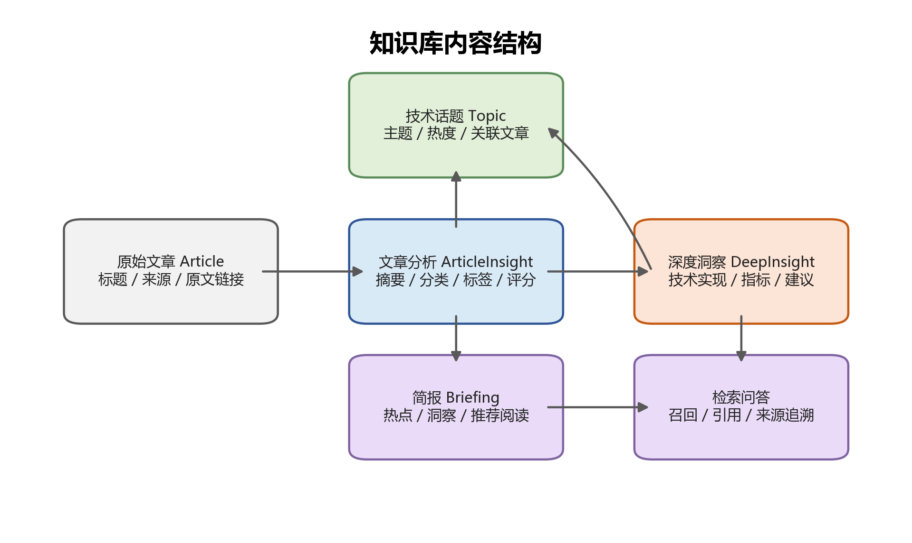

# 一、背景
AI 技术快速演进并持续影响软件研发、平台建设和业务创新，技术团队需要稳定识别关键方向、判断成熟度，并将外部前沿动态转化为可用于架构规划、技术选型和工程实践的内部知识。目前相关信息分散在技术媒体、厂商博客、学术平台、开源社区和人工报告中，筛选、分析和沉淀仍依赖较多人工投入，尚未形成统一、可复用的技术洞察机制。
本项目旨在建设面向技术团队的 AI 技术趋势雷达，形成“信息采集、自动分析、知识沉淀、智能检索、简报输出”的持续能力，为技术规划、方案设计、创新验证和管理汇报提供依据。
前期已基于公司外网络环境搭建可运行的外部版本，能够完成资讯抓取、聚类去重、价值评分、摘要生成和深度洞察等流程。内部版本需复用其验证过的能力，并解决受控采集环境、内部知识库适配、工程化运行、数据源治理和统一运营问题。
# 二、目标
#### 1. 总体目标
建设一套面向技术团队的 AI 技术趋势雷达，将外部技术媒体、厂商博客、学术平台、开源社区及人工报告中的信息，转化为企业内部可检索、可复用、可运营的技术知识资产，支撑趋势洞察、技术选型、智能问答和周期性简报输出。
#### 2. 具体目标
1）建立稳定的 AI 技术信息采集能力，持续获取高质量外部技术资讯，并支持数据源的持续维护和优化。
2）建立自动化分析能力，对采集内容进行去重聚类、主题分类、价值评分、中文摘要和高价值内容深度洞察，降低人工筛选和整理成本。
3）建立企业内部知识沉淀能力，将文章摘要、技术事件、深度洞察卡片等结构化内容同步至内部知识库，形成可持续积累的技术知识资产。
4）建立智能检索与问答能力，支持技术人员围绕技术趋势、产品特性、工程实践和方案参考进行查询，提升知识获取效率。
5）建立周期性技术简报输出能力，支持日报、周报、月报、专题报告等内容生成，为技术团队同步、技术社区运营和管理汇报提供素材。
6）建立统一技术雷达机制，整合自动化采集分析、架构师补充和专家人工报告，减少重复建设，形成统一的数据底座、分类体系和运营口径。
7）建立工程化运行和治理能力，支持任务调度、异常处理、数据源治理、模型成本控制、监控告警和人工审核，保障系统长期稳定运行。
# 三、典型使用场景
1. 技术趋势跟踪。持续跟踪 AI 领域的重要技术动态，覆盖大模型基础技术、Agent、多模态、AI 基础设施、生成式 AI 应用、开源生态等方向，帮助技术团队及时了解外部技术演进和重点事件变化。
2. 技术选型与方案参考。在架构规划、技术选型、方案设计或创新验证过程中，技术团队可基于系统沉淀的文章摘要、技术事件和深度洞察，快速查找外部厂商、开源社区、学术平台中的相关实践，为内部技术判断提供参考。
3. 内部知识库沉淀。系统将外部资讯经过采集、去重聚类、价值评分、摘要生成和深度洞察后，形成结构化内容并进入企业内部知识库，使零散外部信息沉淀为可检索、可复用、可持续积累的内部知识资产。
4. 智能检索与问答。技术人员可围绕某一技术方向、产品特性或工程问题进行自然语言查询，例如“最近 Agent 方向有哪些新进展”或“是否有可参考的大厂工程实践”。系统基于知识库返回相关摘要、洞察和原文来源，提升技术信息获取效率。
5. 周期性技术简报。系统可按日报、周报、月报或专题维度聚合高价值内容，生成技术简报草稿，为技术团队同步、技术社区运营、专题研究和管理汇报提供素材。
6. 统一技术雷达运营。系统可承接自动化采集内容、架构侧补充内容和专家人工报告，逐步形成统一的数据底座、分类体系和运营口径，减少多套技术雷达并行造成的信息重复和口径不一致。
# 四、产品范围
本项目的产品范围以“形成可持续运行的 AI 技术趋势洞察能力”为核心，重点覆盖外部技术信息采集、自动化分析加工、内部知识库沉淀、智能检索问答、周期性简报输出和统一运营治理等能力。
#### 1. 范围内
1）外部 AI 技术资讯采集。系统应通过企业受控采集环境完成信息采集，目标形态优先采用具备目标站点访问能力的企业云主机或经审批的代理/DMZ 主机；支持从技术媒体、厂商博客、学术平台、开源社区、行业研究机构等来源获取 AI 技术内容，并保留标题、链接、发布时间、来源、摘要或正文等基础信息。
2）内容去重、聚类和热度识别。系统应对采集内容进行去重，并按技术事件、产品发布或主题方向进行聚合，形成可用于趋势判断的话题或事件视图。
3）文章摘要、分类和价值评分。系统应生成中文摘要，按照既有 AI 技术分类体系进行归类，并对文章技术价值进行评分，用于筛选高价值内容。
4）高价值内容深度洞察。系统应对高价值文章进一步提取技术背景、核心问题、技术实现、效果指标、应用场景和可借鉴点，形成结构化洞察卡片。
5）内部知识库沉淀。系统应将文章摘要、技术事件、深度洞察卡片等结构化结果沉淀到企业内部知识库，支持检索、问答和复用。知识库应具备通用知识库能力，包括文档入库、标签管理、分段索引、关键词或向量检索、来源追溯等能力。
6）智能检索与问答支撑。系统应基于已入库内容支撑自然语言查询，返回相关摘要、洞察和来源依据，服务技术趋势查询、方案调研和知识复用。
7）周期性简报生成。系统应支持生成日报、周报、月报或专题报告草稿，为技术团队同步、技术社区运营和管理汇报提供素材。
8）模型选型与调用策略。系统建设范围应包含摘要、分类、评分、深度洞察和简报生成等环节的模型选型、调用方式、降级策略和成本控制要求，具体方案在设计与实现阶段细化。
9）数据源与运行治理。系统应支持数据源维护、失效源识别、任务调度、异常记录、失败重试、模型调用统计和基础监控能力，保障长期稳定运行。
10）人工内容纳入统一雷达。系统应预留架构侧补充内容、专家人工报告和人工审核结果的接入能力，使自动化采集内容和人工精选内容能够在统一分类、标签和运营口径下沉淀。
#### 2. 暂不纳入或不作为首要目标
1）暂不建设复杂前端门户，优先完成采集、分析、入库、问答和简报能力。
2）暂不设计个人外网环境到内网的数据通道，信息采集由企业受控采集环境完成，采集结果通过内部存储、知识库 API 或受控导入服务进入内部知识库。
3）暂不展开复杂权限体系，优先复用企业内部知识库既有权限能力。
4）暂不实现多渠道自动发布，简报和报告先以草稿输出为主。
5）暂不扩展为全技术领域雷达，首期聚焦 AI 技术趋势。
#### 3. 待确认边界
人工报告接入方式仍需确认，包括架构侧技术雷达和专家人工报告是否提供结构化输入、是否纳入统一字段、分类和标签体系，以及是否需要人工审核后入库。
#### 4. 首期 MVP 范围

| 范围类型 | 内容 |
| --- | --- |
| 必做 | 1）接入首批不少于 8 个数据源，覆盖技术媒体、厂商博客、学术平台和开源社区。 2）完成 L0-L4 闭环，包括采集、去重聚类、摘要评分、深度洞察和内部知识库入库。 3）支持每日定时抓取，至少保留一次手动补跑能力。 4）对达到 L3 触发阈值的文章生成深度洞察卡片。 5）基于知识库完成典型问题问答验证，回答中必须包含来源依据。 6）生成一份 AI 技术趋势周报草稿。 |
| 选做 | 1）接入架构侧补充内容或专家人工报告样例。 2）生成专题报告草稿。 3）建立初版数据源质量评分和模型调用成本统计。 |
| 暂缓 | 1）复杂前端门户。 2）多渠道自动发布。 3）全员权限矩阵。 4）覆盖 AI 以外的其他技术领域。 |
# 五、功能范围与模块说明
系统功能应围绕“采集、分析、沉淀、检索、输出、治理”形成闭环。现有外网工程已经验证了 L0-L3 的核心处理链路，内部版本应在复用其处理思路和字段经验的基础上，完成企业可管理环境部署、内部知识库适配和工程化治理。

【图1：AI 技术趋势雷达目标架构与数据流，见 assets/figure1_architecture.png】

| 层级 | 功能模块 | 外部版本功能基础 | 内部版本要求 | 差距与后续任务 | 主要产出 |
| --- | --- | --- | --- | --- | --- |
| L0 | 信息采集与数据源管理 | 1）已支持 RSS/网页源抓取。 2）已接入约 12 个外部数据源。 3）已具备文章 ID 去重和并发抓取能力。 | 1）部署在企业受控采集环境中。 2）支持数据源配置、启停、抓取频率配置。 3）记录抓取结果和基础异常信息。 | 1）运行环境需由个人外网环境迁移至企业受控采集环境。 2）数据源需形成正式清单、质量评估和失效处理机制。 3）抓取任务需纳入统一调度和日志管理。 | 原始文章池、数据源清单、抓取日志 |
| L1 | 去重聚类与话题热度 | 1）已通过 L1 动态话题表沉淀事件聚类结果。 2）已维护话题热度、包含文章数、首次涌现时间、最近活跃时间等信息。 | 1）按 URL、标题、发布时间、语义相似度等维度去重。 2）将同一事件、产品发布或技术主题聚合为话题。 3）支持话题热度和关联文章持续更新。 | 1）需明确内部版本的聚类阈值、热度计算口径和重复内容处理规则。 2）需优化低质量重复报道对话题热度的影响。 | 动态话题、热度信息、关联文章 |
| L2 | 摘要分类与价值评分 | 1）已通过 L2 文章总表生成中文标题、AI 分类、AI 打分、摘要、技术标签和涉及厂商。 2）已用评分结果区分“已晋级 L3”和“止步快讯”。 | 1）形成稳定的评分口径和分类体系。 2）识别具备工程实践价值、架构参考价值或重要趋势价值的内容。 3）输出适合内部知识库入库的结构化文章分析结果。 | 1）需固化评分标准，避免模型评分漂移。 2）需补充模型效果评测样例。 3）需将字段命名、分类和标签调整为内部知识库友好格式。 | 文章分析结果、分类标签、高价值文章候选 |
| L3 | 高价值内容深度洞察 | 1）已对高分文章生成 L3 深度洞察卡片。 2）已包含核心痛点、技术实现、量化指标、行动建议等字段。 | 1）对高价值文章提取技术背景、核心问题、实现方案、效果指标、应用场景和内部参考价值。 2）形成可入库、可检索、可进入简报的洞察卡片。 | 1）需明确 L3 触发阈值和深度分析字段标准。 2）需优化洞察内容的事实性、可读性和来源可追溯性。 | 深度洞察卡片、技术参考建议 |
| L4 | 知识库沉淀与智能检索 | 1）已支持同步至火山知识库。 2）已形成可用于知识检索的 L2 摘要和 L3 洞察内容。 | 1）适配企业内部知识库。 2）支持文档入库、标签管理、分段索引、关键词或向量检索、来源追溯。 3）支撑趋势查询、方案参考和专题追踪类问答。 | 1）需在概要设计中对接内部知识库 API、分段、标签、向量检索和权限能力。 2）需设计入库对象、字段映射和召回策略。 3）需验证典型问题的问答效果。 | 知识库文档、索引数据、问答结果 |
| L5 | 简报输出与运营治理 | 1）外部版本已具备支撑简报的文章摘要、话题和洞察基础。 2）已具备基础重试、模型 fallback 和运行统计。 | 1）支持日报、周报、月报或专题报告草稿生成。 2）支持任务调度、日志、监控、告警、模型成本统计和 Prompt 版本管理。 3）预留人工内容接入和审核能力。 | 1）需设计简报模板、生成周期和人工复核机制。 2）需补齐正式运行监控和告警能力。 3）需确认架构侧补充内容和专家报告的接入方式。 | 简报草稿、专题材料、运行记录、监控指标 |

【图2：内容处理流水线，见 assets/figure2_pipeline.png】

核心处理流程如下：

1. L0 信息采集。系统按配置从外部技术数据源获取文章信息，保留标题、链接、发布时间、来源、摘要或正文等基础字段。
2. L1 去重聚类。系统识别已处理文章，并将新文章纳入已有话题或生成新话题，维护话题热度和关联文章。
3. L2 摘要评分。系统对新文章生成中文标题、摘要、技术分类、标签、涉及厂商和价值评分。
4. L3 深度洞察。系统对达到高价值阈值的文章读取正文并生成深度洞察卡片。
5. L4 知识沉淀。系统将文章分析结果、话题信息和深度洞察同步至内部知识库，并形成可检索索引。
6. L5 应用输出。知识库内容支撑智能检索、趋势问答、周期性简报生成和统一运营治理。

# 六、数据与知识库要求
#### 1. 核心数据对象

| 数据对象 | 说明 | 关键字段 |
| --- | --- | --- |
| 数据源 Source | 记录外部信息来源及采集配置 | source_id、source_name、source_type、url、抓取频率、启用状态、最近抓取时间、健康状态 |
| 原始文章 Article | 记录抓取到的原始文章信息 | article_id、title、url、source_name、publish_time、crawl_time、language、raw_summary、raw_content、content_hash |
| 技术话题 Topic | 记录聚类后的技术事件或趋势主题 | topic_id、topic_name、topic_summary、category、heat_score、article_count、first_seen_time、latest_seen_time、related_articles |
| 文章分析 ArticleInsight | 记录文章级摘要、分类、评分和标签 | article_id、zh_title、summary_cn、category、value_score、tech_tags、companies、process_status、model_name、prompt_version |
| 深度洞察 DeepInsight | 记录高价值文章的深度分析结果 | insight_id、article_id、core_problem、technical_solution、metrics、action_suggestions、internal_reference、generated_time |
| 简报 Briefing | 记录周期性输出内容 | briefing_id、briefing_type、time_range、hot_topics、key_insights、recommended_reads、generated_content、review_status |

所有核心对象应保留治理字段，包括 `status`、`created_at`、`updated_at`、`version`、`source_type`、`quality_score`、`review_status`、`error_message`、`model_name`、`prompt_version`。人工维护对象应保留 `created_by`、`updated_by`；系统生成对象应保留 `job_id`、`task_id` 或 `producer`，用于追踪生成任务和责任来源。其中 `status` 用于记录采集、分析、入库、发布等处理状态；`review_status` 用于记录是否经过人工复核；`error_message` 用于记录失败原因，便于补跑和排障。

#### 2. 评分与晋级规则

系统应采用 `value_score` 表示文章技术价值，评分范围为 1-10 分，分数越高表示越值得进入深度分析、知识库重点沉淀和简报候选。

| 评分维度 | 说明 |
| --- | --- |
| 技术深度 | 是否包含明确技术原理、架构设计、算法机制、工程实现或性能优化内容。 |
| 工程参考价值 | 是否可为内部架构规划、技术选型、研发实践或平台建设提供参考。 |
| 趋势重要性 | 是否代表 AI 技术方向、产品形态、开源生态或行业实践的重要变化。 |
| 来源可信度 | 来源是否为高质量技术媒体、厂商官方博客、学术平台、开源社区或可信研究机构。 |
| 时效性 | 内容是否具备近期关注价值，是否反映新发布、新进展或正在形成的趋势。 |

首期各评分维度可按等权处理，后续根据人工评测结果、简报采用情况和问答反馈调整权重。

L3 深度洞察默认触发阈值为 `value_score >= 8`。7 分内容可进入简报候选或人工复核队列；6 分及以下内容默认仅保留摘要和基础标签，不触发深度洞察。阈值应配置化管理，后续可根据模型效果、成本和内容质量进行调整。

简报候选内容优先从以下范围产生：`value_score >= 8` 的深度洞察内容、近期热度明显上升的话题、架构侧人工补充内容、专家审核通过内容。运营人员可在人工复核时修正评分、标签、分类和是否进入简报的判断。

#### 3. 数据对象关系

| 关系 | 说明 |
| --- | --- |
| Source 1 - N Article | 一个数据源可产生多篇原始文章，文章需保留来源标识和抓取时间。 |
| Article 1 - 1 ArticleInsight | 每篇进入分析流程的文章应生成一条文章分析结果。 |
| Topic N - N ArticleInsight | 一个话题可关联多篇文章，一篇文章也可能关联主话题和辅助话题。 |
| ArticleInsight 1 - 0/1 DeepInsight | 一条文章分析结果最多生成一条深度洞察；一条深度洞察必须来源于一条文章分析结果。 |
| Topic 1 - N DeepInsight | 一个技术话题下可沉淀多张深度洞察卡片。 |
| Briefing N - N Topic/DeepInsight | 一份简报可引用多个话题和洞察卡片，话题和洞察也可被多期简报复用。 |

数据对象生命周期应覆盖以下状态：`created`、`processing`、`analyzed`、`clustered`、`promoted_to_deep_insight`、`stored`、`review_pending`、`reviewed`、`published`、`failed`、`archived`。概要设计可根据实际实现合并状态，但不得缺失失败、待审核、已入库和已归档等关键状态。

#### 4. 分类与标签要求

系统应沿用并持续优化现有 AI 技术主题分类，首期覆盖以下方向：

1）大模型基础技术：预训练技术、模型架构创新、推理优化、微调技术、模型压缩、MoE 技术等。
2）Agent 与智能体：智能体框架、多智能体协作、工具调用、规划推理、记忆系统、Agent 工程化落地等。
3）多模态技术：文生图/视频、多模态理解、3D 生成、语音技术、数字人、多模态融合架构等。
4）AI 基础设施：算力网络、GPU/AI 芯片优化、分布式训练、数据库与存储、云服务、边缘计算等。
5）生成式 AI 应用：代码生成、内容创作、企业级 AI 应用、垂直领域落地、Copilot 产品演进等。
6）安全与伦理：AI 安全、对齐技术、偏见治理、版权问题、监管政策、伦理风险防控等。
7）开源生态：开源模型发布、社区动态、工具链演进、开源商业化路径等。
8）行业动态：大厂技术发布、融资事件、人才趋势、技术政策、产业落地案例等。

标签应至少覆盖技术标签、厂商或产品标签、应用场景标签、内容类型标签和成熟度标签。标签生成结果应服务于检索、聚合、简报生成和专题分析。

#### 5. 知识库入库要求

【图3：知识库内容结构，见 assets/figure3_knowledge_objects.png】

内部知识库应作为技术趋势雷达的核心沉淀位置，入库内容应满足以下要求：

1）结构化入库。文章摘要、技术话题、深度洞察卡片和简报应按不同对象沉淀，避免仅以整篇长文本混合入库。
2）检索友好。入库内容应带有分类、标签、来源、发布时间、评分、关联话题等字段，支持关键词检索、标签筛选和向量召回。
3）来源可追溯。每条摘要和洞察应保留原文链接、来源名称、发布时间、生成时间和模型信息，便于复核。
4）问答可引用。知识库应支持智能体在回答中引用来源内容，回答技术趋势或方案参考类问题时应返回依据。
5）可持续更新。知识库应支持增量入库、更新覆盖、重复内容识别和失效内容处理。

# 七、运行与部署要求
#### 1. 部署模式与数据流转边界

系统部署应采用企业受控采集环境，不长期依赖个人外网环境，也不建设个人外网环境到内网的数据通道。受控采集环境可采用企业境外云主机、DMZ 主机或经审批的代理访问主机，具体形态由概要设计结合网络、安全和资源条件确定。

过渡态要求：复用现有外网工程中的采集、聚类、评分、摘要和深度洞察能力，将代码和配置迁移到企业受控采集环境运行；采集结果落地到内部可管理存储，并通过内部知识库 API、受控导入服务或同等内部接口完成入库。

目标态要求：采集、分析、入库、检索问答、简报生成和运行治理均纳入企业可管理环境；系统以内部知识库为统一沉淀位置，所有可复用内容均通过结构化对象进入知识库，不保留个人外部环境作为长期生产依赖。

数据流转边界如下：

1）外部公开数据源只作为输入来源，系统仅采集公开技术资讯及其元数据。
2）采集与分析任务运行在企业受控采集环境中，生成结构化文章、话题和洞察结果。
3）结构化结果通过内部接口进入企业内部知识库，不通过个人外网到内网的人工摆渡链路。
4）智能问答和简报生成基于内部知识库内容运行，回答和简报应保留来源引用。
5）系统运行日志、模型调用记录和任务状态应保存在企业可管理环境中。

#### 2. 接口与集成约束

| 集成对象 | 需求约束 |
| --- | --- |
| 内部知识库 | 应支持文档或结构化内容入库、标签字段、分段索引、关键词或向量检索、来源追溯、权限继承和问答引用。 |
| 模型服务 | 应支持摘要、分类、评分、深度洞察和简报生成任务；具备调用鉴权、失败重试、降级策略、成本统计和 Prompt 版本管理能力。 |
| 任务调度 | 应支持定时任务、手动补跑、任务状态记录、失败重试、运行耗时统计和异常告警。 |
| 数据源配置 | 应支持数据源新增、启停、类型标记、抓取频率、健康状态和质量评分维护。 |
| 内容导入 | 若知识库 API 暂不可用，应支持企业内部受控文件导入或批量导入服务，字段格式需与核心数据对象保持一致。该方式属于企业内部受控链路，不作为个人外网到内网的手工摆渡。 |

#### 3. 任务调度

系统应支持定时调度和手动补跑。调度任务至少包括数据源抓取、文章分析、话题聚类、深度洞察生成、知识库入库、简报生成和数据源健康检查。任务执行结果应记录成功、失败、耗时、处理数量和异常原因。

#### 4. 模型调用

系统应根据任务类型配置模型调用策略。常规摘要、分类和评分可优先采用成本较低、响应较快的模型；高价值文章深度洞察、专题分析和简报生成可采用效果更好的模型。模型调用应支持失败重试、降级兜底、成本统计和 Prompt 版本管理。

#### 5. 角色与人工审核流程

| 角色 | 操作边界 |
| --- | --- |
| 系统管理员 | 维护运行环境、调度任务、系统配置、模型配置、日志和告警。 |
| 运营人员 | 维护数据源、检查任务结果、复核简报草稿、处理失败任务和低质量内容。 |
| 架构师 | 查看趋势内容、补充技术判断、参与专题内容复核和技术方向判断。 |
| 专家审核人 | 对专家报告、重点洞察或管理汇报材料进行审核确认。 |
| 普通查询用户 | 使用知识库或智能体查询技术趋势、文章摘要、洞察和来源。 |

自动采集内容默认可进入文章分析和知识库沉淀流程，入库时应标记 `content_source=auto_generated`、`review_status=review_pending`。此类内容可用于内部检索和问答，但用于管理汇报、正式发布、专家报告归档或多渠道推送前必须经过人工复核，并将 `review_status` 更新为 `reviewed`。专家人工报告、架构侧补充内容和人工修订内容的接入方式仍待确认，确认前不作为自动入库的强制范围。

#### 6. 监控与告警

系统应对抓取数量、抓取失败率、分析成功率、入库成功率、模型调用次数、模型失败率、数据源健康状态和任务运行耗时进行监控。对于连续抓取失败、入库失败、模型调用异常、数据源长期无更新等情况，应具备告警或人工检查机制。

#### 7. 安全与权限

系统应遵循企业内部安全与权限要求。外部文章内容进入内部知识库前应保留来源信息，不引入未经确认的敏感内部数据。内部知识库访问权限优先复用既有权限体系，系统侧不单独设计复杂权限模型。

#### 8. 非功能要求

| 类别 | 要求 |
| --- | --- |
| 性能 | 单次常规抓取和分析任务应在可配置时间窗口内完成，首期建议单轮任务不超过 2 小时。 |
| 可用性 | 定时任务应具备失败重试和手动补跑能力，关键任务失败应可定位原因。 |
| 可维护性 | 数据源、评分阈值、分类体系、模型配置、Prompt 模板和简报模板应配置化管理。 |
| 可观测性 | 应记录任务状态、处理数量、失败原因、模型调用次数、入库结果和数据源健康状态。 |
| 成本控制 | 应区分轻量分析和深度分析任务，控制高成本模型调用触发条件，并统计模型调用量。 |
| 数据保留 | 原始抓取记录、分析结果、洞察卡片、简报和运行日志应设置保留周期，首期可按不少于 6 个月设计。 |
| 可追溯性 | 所有入库内容应保留原文来源、生成时间、模型名称和 Prompt 版本。 |

# 八、验收标准
验收应以首期 MVP 闭环为准，重点验证 L0-L4 是否稳定运行，并验证 L5 简报和问答是否具备可用基础。以下指标作为首期评审口径；如需调整，应经评审确认。

| 验收项 | 量化验收标准 |
| --- | --- |
| 数据源接入 | 首批启用数据源不少于 8 个，覆盖技术媒体、厂商博客、学术平台、开源社区中至少 3 类来源。 |
| 定时采集 | 支持每日定时抓取不少于 1 次，并支持手动补跑；连续 7 日运行期间，启用数据源抓取成功率不低于 80%。 |
| 元数据完整性 | 入库文章中标题、来源、原文链接、发布时间或抓取时间字段完整率不低于 95%。 |
| 增量与去重 | 重复入库率不高于 5%；同一 URL 或同一内容哈希不得重复入库。 |
| 文章分析 | 对成功抓取的新文章，摘要、分类、标签、评分字段生成成功率不低于 90%。 |
| 话题聚类 | 抽检不少于 30 条文章聚类结果，人工判断主题归并基本合理的比例不低于 80%。 |
| 深度洞察 | 在正文可获取且模型调用可用的情况下，`value_score >= 8` 的文章应触发深度洞察生成；抽检不少于 20 条洞察卡片，核心问题、技术实现、行动建议三类字段完整率不低于 90%。 |
| 知识库入库 | 文章分析结果和深度洞察入库成功率不低于 95%，且每条内容可追溯原文来源。 |
| 智能问答 | 以不少于 10 个典型问题进行验证，人工评审认为回答相关且来源支撑充分的比例不低于 80%，所有回答必须返回来源引用。 |
| 简报生成 | 至少生成 1 份 AI 技术趋势周报草稿；经人工复核后，主要栏目完整，内容可作为内部同步材料继续编辑使用。 |
| 运行治理 | 任务执行结果、失败原因、处理数量、模型调用次数和入库结果应完整记录，关键任务失败应可定位并支持补跑。 |
| 配置维护 | 数据源、分类体系、评分阈值、模型配置和 Prompt 模板应支持配置化维护，不依赖直接修改核心代码完成日常调整。 |

# 九、风险与待确认事项
#### 1. 主要风险

| 风险 | 影响 | 应对要求 |
| --- | --- | --- |
| 受控采集环境审批或网络访问不满足要求 | 目标数据源无法稳定访问，影响首期闭环 | 在概要设计阶段优先完成采集环境选型、网络连通性验证和数据源访问测试 |
| 外部数据源访问不稳定 | 抓取失败、内容缺失 | 建立数据源健康检查、失败重试和备用源机制 |
| 数据源质量参差不齐 | 低价值内容过多，影响分析和简报质量 | 建立来源权重、评分阈值和数据源淘汰机制 |
| 内部知识库接口能力不足 | 入库、检索或问答引用效果不达预期 | 提前验证 API、标签、分段、向量检索、权限继承和引用展示能力 |
| 模型生成结果不稳定 | 摘要、评分或洞察质量波动 | 建立 Prompt 版本管理、样例评测和人工抽检机制 |
| 模型调用成本过高 | 长期运行成本不可控 | 采用分层模型策略，控制深度分析触发阈值 |
| 知识库检索效果不足 | 问答召回不准，影响使用体验 | 优化入库结构、标签、分段和召回策略 |
| 简报内容可读性不足 | 输出材料难以直接复用 | 建立简报模板和人工复核机制 |
| 多来源口径不一致 | 自动化内容与人工报告难以统一沉淀 | 建立统一分类、标签、字段和审核规则 |

#### 2. 待确认事项

1）人工报告接入方式：需确认架构侧技术雷达和专家人工报告是否提供结构化输入、输入频率、字段格式和审核要求。
2）内部知识库平台：需确认最终承接平台及其 API、标签、分段、向量检索、权限和智能体集成能力。
3）模型组合：需在设计阶段完成摘要、评分、分类、深度洞察和简报生成任务的模型效果与成本对比。
4）简报模板：需确认周报、月报、专题报告和管理汇报材料的固定结构、输出频率和复核责任人。
5）数据源清单：需确认首批正式启用数据源、候选扩展数据源、停用规则和质量评估口径。
